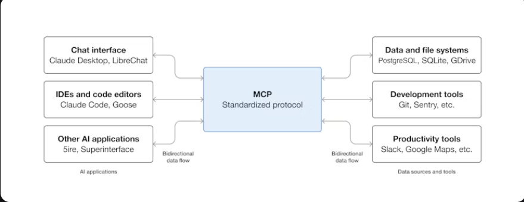

# Model Context Protocol(MCP)
- MCP (Model Context Protocol) is an open-source standard for connecting AI applications to external systems.
- MCP is a game-changer for developers and organizations looking to harness the power of AI without the overhead of building custom integrations for every system.

## Why does MCP matter?
- Depending on where you sit in the ecosystem, MCP can have a range of benefits.
- Developers: MCP reduces development time and complexity when building, or integrating with, an AI application or agent.
- AI applications or agents: MCP provides access to an ecosystem of data sources, tools and apps which will enhance capabilities and improve the end-user experience.
- End-users: MCP results in more capable AI applications or agents which can access your data and take actions on your behalf when necessary.

